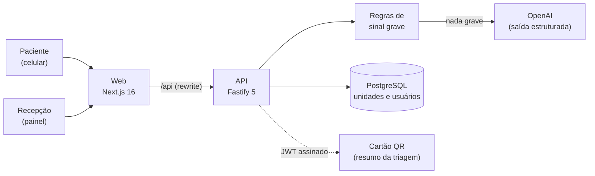

# Triar

**Diz o que você sente. Mostra para onde ir — no SUS ou no plano.**

**Demo:** [triar.nebularlabs.com.br](https://triar.nebularlabs.com.br)

O Triar é um app de pré-triagem para o celular. A pessoa conta o que está sentindo, o app classifica a urgência pelo Protocolo de Manchester (níveis 1 a 5) e indica a unidade certa para aquele caso, perto e menos lotada, no SUS ou no plano de saúde. No fim, gera um cartão com QR code que a recepção da unidade lê antes de o paciente ser atendido.

> O Triar orienta e encaminha. Não é diagnóstico e não substitui atendimento médico. Em caso de dúvida, ligue 192.

[1. Negócio](#1-negócio) · [2. Parte técnica](#2-parte-técnica) · [Como rodar](#como-rodar) · [Equipe](#equipe) · [Fontes](#fontes)

---

## 1. Negócio

### A dor

Quem passa mal não sabe para onde ir. UBS, UPA ou pronto-socorro? Qual está menos cheia agora? Na dúvida, a pessoa vai para a emergência, e a emergência lota de casos que poderiam ser resolvidos em outro lugar.

- **A maior parte de quem chega à emergência não é urgente.** Na maior emergência do Sul do país, 73,2% dos 139.556 atendimentos de adultos em um ano foram classificados como verde (pouco urgente) ou azul (não urgente) pelo Protocolo de Manchester [[1]](#fontes).
- **A atenção básica resolveria a maioria dos casos.** Segundo o Ministério da Saúde, cerca de 85% dos problemas de saúde podem ser resolvidos sem ir a uma emergência ou pronto-socorro [[2]](#fontes).
- **No plano, o pronto-socorro custa caro.** Em 2019, beneficiários de planos fizeram 57,2 milhões de consultas em pronto-socorro (1 em cada 5 consultas médicas), e as operadoras gastaram R$ 6,4 bilhões com elas [[3]](#fontes).

O resultado são filas maiores, mais espera para quem é grave de verdade e uma equipe de recepção que só conhece cada caso quando a pessoa já está na fila.

### A solução

Do sintoma à recepção em 6 passos, no celular, sem login e sem instalar nada:

1. **Início:** a pessoa escolhe SUS ou plano e libera a localização.
2. **Sintomas:** marca o que sente (dor, febre, falta de ar…) e pode descrever com as próprias palavras.
3. **Perguntas:** há quanto tempo, intensidade da dor, idade e gestação. Se aparecer um sinal grave, o app vai direto para a tela de **Emergência 192**.
4. **Resultado:** o nível de urgência (cor, número e palavra), o que fazer agora e os sinais de alerta.
5. **Unidades:** mapa e lista das unidades indicadas para aquele nível, da menos lotada para a mais lotada, com distância e tempo estimado.
6. **Cartão de triagem:** QR code para mostrar na recepção.

Do outro lado, a **recepção da unidade** entra no painel, atualiza a lotação ao vivo e lê o cartão. Assim vê a pré-triagem do paciente, com a fila já ordenada por nível de urgência.

**O que diferencia o Triar:**

- **Segurança antes da IA.** Sinais graves (dor no peito com falta de ar, desmaio, sangramento na gravidez, convulsão, fala enrolada, risco de suicídio…) são detectados por regras fixas e mandam a pessoa ligar 192 na hora, sem esperar a IA. Na dúvida, a regra escolhe a emergência.
- **Protocolo de Manchester com linguagem simples.** A IA classifica do nível 2 ao 5 e explica sem diagnóstico: "seus sintomas indicam…", nunca "você tem…".
- **SUS e plano no mesmo app.** O nível decide o tipo de unidade em cada rede. No SUS, UPA ou hospital para os casos graves e UBS para os leves. No plano, pronto-socorro para os graves e teleconsulta ou clínica para os leves.
- **Lotação ao vivo.** A recepção atualiza a lotação, e a lista do paciente se atualiza sozinha a cada 10 segundos. Se a unidade mais perto lotou, o app avisa e sugere outra.
- **Cartão à prova de adulteração.** O nível vai assinado dentro do QR. Mudar o resultado pelo navegador não muda o cartão.
- **LGPD desde o início.** Nenhum dado de saúde é salvo em banco. Ele fica só no celular, enquanto a aba está aberta, e dentro do QR.
- **Acessível.** O nível aparece sempre com cor, número e palavra (quem é daltônico também entende), e o botão "Emergência 192" está em todas as telas.

**Validação:** o Prof. Herycles Fortaleza testou e validou o que já existe: as unidades próximas e quais estão lotadas, e a triagem com sintomas, idade e nível de dor. O feedback de profissionais já entrou no app, com dois sintomas novos (coceira e formigamento).

### Possíveis resultados

Usamos a fórmula XYZ do Google: **"Alcançar [X], medido por [Y], fazendo [Z]"**. São metas para um piloto, não resultados já medidos.

| Alcançar (X) | Medido por (Y) | Fazendo (Z) |
|---|---|---|
| Tirar das emergências os casos que a UBS resolve | % de triagens de nível 4 e 5 que escolheram UBS ou teleconsulta | Indicar o tipo de unidade pelo nível de urgência, e não "a emergência mais perto" |
| Distribuir melhor a demanda entre as unidades | Diferença de lotação entre UPAs próximas no mesmo horário | Ordenar as unidades pela lotação ao vivo antes da distância |
| Encurtar o caminho até a classificação de risco na recepção | Tempo entre a chegada e a classificação do paciente | Entregar o paciente com o cartão pré-triado e o painel já ordenado por nível |
| Reduzir o gasto dos planos com pronto-socorro | Consultas em pronto-socorro de casos nível 4 e 5, comparadas às teleconsultas | Indicar teleconsulta ou clínica no plano para os casos pouco urgentes |
| Nenhum caso grave esperando a IA | % de sinais graves que chegaram à tela de Emergência sem chamar a IA | Rodar regras fixas antes da IA, cobertas por testes automatizados |

---

## 2. Parte técnica

### Arquitetura



Monorepo com **npm workspaces + Turborepo**: [`apps/web`](apps/web) (front) e [`apps/server`](apps/server) (API). O back segue o fluxo `routes → controllers → cases`: a rota só registra, o controller valida a entrada com Zod e o case concentra a regra de negócio e as queries.

### Stack

**Front — [`apps/web`](apps/web)**

| Camada | Escolha |
|---|---|
| Framework | Next.js 16 (App Router, Turbopack) + React 19 |
| Linguagem | TypeScript `strict`, com rotas tipadas |
| Estilo | Tailwind CSS v4 + shadcn/ui sobre Radix, seguindo o design system Triar v1 |
| Dados do servidor | TanStack Query v5 + Axios |
| Estado do fluxo | Zustand v5 (persistido no `sessionStorage`) |
| Formulários | React Hook Form + Zod v4 |
| Mapa | Leaflet + react-leaflet (OpenStreetMap) |
| Cartão | qrcode.react + html-to-image (salvar o cartão como imagem) |

**Back — [`apps/server`](apps/server)**

| Camada | Escolha |
|---|---|
| Servidor | Fastify 5 + TypeScript |
| Banco | PostgreSQL + Knex (migrations e seeds) |
| Validação | Zod (também gera o schema do Swagger) |
| IA | OpenAI, sempre pelo wrapper `generate_json`, com a resposta validada por schema |
| Autenticação | JWT HS256 (`jose`) em cookie httpOnly; senha com scrypt (`node:crypto`) |
| Build | tsup (produção) e tsx (desenvolvimento) |

**Monorepo e infraestrutura**

| Ferramenta | Uso |
|---|---|
| npm workspaces + Turborepo | Uma instalação para as duas apps; `dev`, `build`, `typecheck` e `test` orquestrados com cache |
| Biome | Lint, formatação e ordenação de imports |
| GitHub Actions | CI a cada push e pull request na `main` |
| Docker + PM2 | Imagem do server (`turbo prune`) e deploy com [`update.sh`](update.sh), que não derruba a versão no ar se um passo falhar |

### Decisões técnicas

- **Regras antes da IA** ([`triage-rules.ts`](apps/server/src/cases/triage/triage-rules.ts)). São funções puras, e o nível 1 (Emergência) é exclusivo delas: fica fora até do schema da IA.
- **IA com saída estruturada** ([`triage-prompt.ts`](apps/server/src/cases/triage/triage-prompt.ts)). A resposta precisa bater com um schema Zod (nível, título, explicação, orientações, sinais de alerta). Se a IA falhar, a rota responde 503 e as regras continuam funcionando.
- **Proteção contra prompt injection.** O relato livre entra delimitado entre `<relato>` e `</relato>`, com `<` e `>` trocados, e o prompt manda tratá-lo só como descrição de sintomas.
- **Tokens com `audience` separada** ([`tokens.ts`](apps/server/src/libs/tokens.ts)). O resultado da triagem (`triage-result`) e o cartão (`card`) são JWTs diferentes, e um não vale como o outro. `POST /api/cards` só aceita o resultado assinado pelo próprio server.
- **LGPD na arquitetura.** O banco guarda só unidades e usuários da recepção. O estado do fluxo fica no `sessionStorage`, e o resumo da triagem só existe dentro do token do QR.
- **Ranking de unidades** ([`list-units-case.ts`](apps/server/src/cases/units/list-units-case.ts)). Primeiro o tipo de unidade, pelo nível e pela rede. Depois a lotação e, por fim, a distância (linha reta, tempo estimado a ~25 km/h).

### Documentação

| Onde | O que tem |
|---|---|
| **Swagger / OpenAPI** em `http://localhost:4000/docs` | Todas as rotas da API, testáveis pelo navegador. É gerado dos próprios schemas Zod das rotas (`fastify-type-provider-zod`), então acompanha a validação. Disponível no ambiente de desenvolvimento. |
| [`apps/server/README.md`](apps/server/README.md) | Rotas, variáveis de ambiente, scripts, estrutura de pastas e deploy com Docker |
| [`apps/server/CLAUDE.md`](apps/server/CLAUDE.md) | Arquitetura, convenções e o passo a passo para criar um endpoint |
| [`apps/web/README.md`](apps/web/README.md) | Setup e variáveis do front |
| [`apps/web/docs/`](apps/web/docs) | 8 guias curtos com código real: [design system](apps/web/docs/design-system.md), [arquitetura](apps/web/docs/arquitetura.md), [convenções](apps/web/docs/convencoes.md), [dados](apps/web/docs/dados.md), [formulários](apps/web/docs/formularios.md), [estado](apps/web/docs/estado.md), [componentes](apps/web/docs/componentes.md) e [autenticação](apps/web/docs/autenticacao.md) |
| [`docs/telas-do-sistema.md`](docs/telas-do-sistema.md) | Cada tela explicada em linguagem simples |
| [`docs/Triar-design-system.pdf`](docs/Triar-design-system.pdf), [`docs/Triar-telas.pdf`](docs/Triar-telas.pdf) | Design system e telas |
| [`docs/pending.md`](docs/pending.md) | O que já foi feito e os próximos passos |
| [`instructions.md`](instructions.md) | Guia completo para rodar e desenvolver |

### Testes automatizados

**Técnica: testes e2e de rota.** Cada teste sobe a API real (`create_app()`) e faz requisições HTTP com **supertest**. A requisição passa por rota, validação, regra de negócio e banco, como em produção.

- **32 testes em 7 specs** ([`apps/server/test/e2e/`](apps/server/test/e2e)), com **Vitest**.
- **Banco de verdade.** Um PostgreSQL de teste (Docker, porta 5441) recebe as migrations uma vez no [`global-setup.ts`](apps/server/test/global-setup.ts), e elas são desfeitas no fim. As fixtures (`create_unit`, `create_user`, `login`, `clear_database`) ficam em [`test/helpers.ts`](apps/server/test/helpers.ts).
- **IA isolada.** O módulo `~/libs/ai` é substituído nos testes (`vi.mock`) por respostas controladas: os testes são determinísticos, não custam nada e o CI não precisa de chave da OpenAI.
- **Specs em sequência** (`fileParallelism: false`), porque compartilham o mesmo banco.

| Spec | O que garante |
|---|---|
| `triage.spec.ts` (7) | Sinal grave detectado pelas regras, nos sintomas e no relato livre, sem chamar a IA. Classificação pela IA, 503 quando ela falha e rejeição de corpo inválido. |
| `cards.spec.ts` (11) | O cartão só nasce de um resultado assinado. Recusa resultado adulterado e troca de tipo de token, exige login para ler e testa o fluxo completo triagem → cartão → leitura com o mesmo nível. |
| `units.spec.ts` (6) | Unidades certas para cada nível e rede, a menos lotada primeiro. A recepção só altera a lotação da própria unidade. |
| `sessions.spec.ts` (5) | Login por telefone com máscara, cookie httpOnly, `/me` e logout. |
| `symptoms`, `health`, `demo-cards` (1 cada) | Catálogo de sintomas, health check com o banco e os cartões de demonstração. |

**CI** ([`.github/workflows/ci.yml`](.github/workflows/ci.yml)), a cada push e pull request na `main`: Biome → typecheck → build → testes, com o PostgreSQL subindo como service do GitHub Actions.

O front não tem testes automatizados: é testado manualmente, no celular e no modo responsivo do navegador. No CI, ele passa por lint, typecheck (TypeScript `strict` e rotas tipadas) e build.

---

## Como rodar

Requisitos: Node.js 22+ e Docker.

```bash
npm install
cp apps/server/.env.example apps/server/.env.local   # coloque sua OPENAI_API_KEY
cp apps/web/.env.example apps/web/.env
npm run db:up && npm run migrate:latest && npm run seed:run
npm run start:dev   # web em http://localhost:3000 e API em http://localhost:4000 (Swagger em /docs)
```

Variáveis de ambiente, usuários da recepção para testar o painel, cartões de demonstração e todos os scripts estão no [`instructions.md`](instructions.md).

## Equipe

| Nome | Papel |
|---|---|
| Gabriel Soares | Desenvolvimento |
| Nadson | Desenvolvimento |
| Pedro | Produto e parte não técnica |
| Patrick | Produto e parte não técnica |

## Fontes

1. Anziliero F. et al. [Sistema Manchester: tempo empregado na classificação de risco e prioridade para atendimento em uma emergência](https://www.scielo.br/j/rgenf/a/ZPt8CVtgXpftkT7MszL8KtP/?lang=pt). *Revista Gaúcha de Enfermagem*, 2016. Dados de 2012: 69,7% verde e 3,5% azul.
2. CONASS. [Atenção Primária é capaz de resolver 85% das demandas de saúde](https://www.conass.org.br/atencao-primaria-e-capaz-de-resolver-85-das-demandas-de-saude/), 27/06/2019. Dado do Ministério da Saúde.
3. IESS. [Análise especial do Mapa Assistencial da Saúde Suplementar no Brasil entre 2015 e 2020](https://www.iess.org.br/sites/default/files/2021-10/analise-mapa-assistencial-2015-a-2020.pdf), 2021. Dados do SIP/ANS, tabela 6 (consultas) e tabela 15 (despesas).
